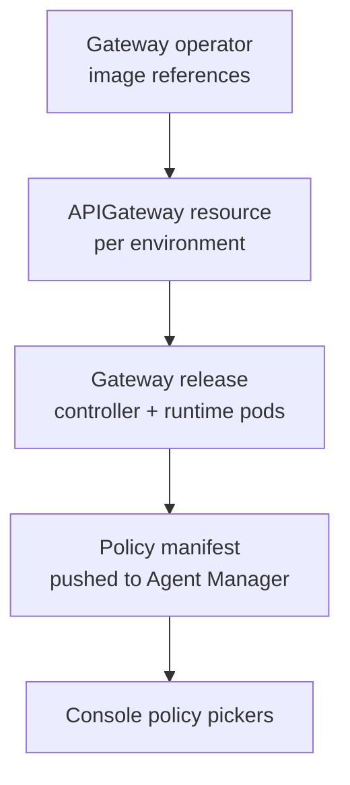

# Use a Custom Gateway Image

A gateway's policy set is fixed when its image is built. To add your own policy, you build a gateway image that includes it, then point your Agent Manager deployment at that image.

This guide covers the second half: taking an image you have already built and published, and getting its policies through to the console. For building the image itself, see [Customizing Gateway Policies](https://github.com/wso2/api-platform/blob/main/docs/cli/customizing-gateway-policies.md) in the WSO2 API Platform documentation, which covers the `ap gateway image build` command and the `build.yaml` file that lists your policies.

## Two Helm Releases Per Environment

Each environment has two Helm releases, and the distinction matters for every step below:

| Release | Chart | What it does |
|---|---|---|
| Extension release (`api-platform-<org>-<env>`) | `wso2-amp-api-platform-gateway-extension` | Registers the gateway with Agent Manager, creates the `APIGateway` resource, and renders the environment's gateway configuration into a ConfigMap |
| Gateway release (`api-platform-<org>-<env>-gw`) | `gateway` | Created by the gateway operator. Runs the controller and runtime pods |

The gateway operator reads the `APIGateway` resource and installs the gateway release from two sources merged together: its own `gateway.values`, which carry the image references, and the environment's ConfigMap, which carries the configuration such as [guardrail system parameters](./configure-guardrail-system-parameters.mdx).



:::warning
The operator redeploys a gateway only when its `APIGateway` resource or the environment's ConfigMap changes. A change to the operator's own values is not one of those triggers: for an environment that already exists, it logs `APIGateway already deployed, skipping` and changes nothing.

Updating the operator alone therefore leaves existing environments untouched, and updating an environment alone does not last. The next time that environment's configuration changes, the operator redeploys it from its own values and the gateway reverts to the image the operator holds. Step 1 updates the operator; Step 3 updates the environments you already have. Both are required.
:::

## Prerequisites

- A gateway image built with your policies and pushed to a registry your cluster can pull from.
- `helm` and `kubectl` configured against the cluster.
- The image is readable by the cluster. For a private registry, create an image pull secret in each gateway namespace first.

## Step 1: Point the Gateway Operator at Your Image

This sets the image used for environments created from now on, and for every later redeployment of the ones you already have.

The operator is installed in `openchoreo-data-plane` and receives image references as `gateway.values.*`. Find the operator version you installed, so the upgrade changes only the image:

```bash
helm list -n openchoreo-data-plane -f '^gateway-operator$'
```

The `CHART` column reads `gateway-operator-<version>`. Upgrade to your repository and tag at that same version:

```bash
helm upgrade gateway-operator \
  oci://ghcr.io/wso2/api-platform/helm-charts/gateway-operator \
  --version <operator-version> \
  --namespace openchoreo-data-plane \
  --reuse-values \
  --set gateway.values.gateway.controller.image.repository=<your-registry>/gateway-controller \
  --set-string gateway.values.gateway.controller.image.tag=<your-tag> \
  --set gateway.values.gateway.gatewayRuntime.image.repository=<your-registry>/gateway-runtime \
  --set-string gateway.values.gateway.gatewayRuntime.image.tag=<your-tag> \
  --set gateway.values.gateway.config.controller.policies.definitions_path=./policies
```

Both the controller and the runtime image come from the same build and must move together. A controller on your custom build with a stock runtime reports policies the runtime cannot execute.

The tags use `--set-string` because `--set` turns a tag that looks like a number, such as `1.2` or `20261005`, into a number, which is not a valid image reference.

`--reuse-values` preserves the settings the operator was installed with, such as the gateway chart version and the encryption key secret name. Without them the gateway cannot start: it requires its encryption keys.

:::warning Setup scripts reset the image
On a quick-start or k3d install, `deployments/setup/ensure-gateway-operator.sh` reinstalls the operator on every setup run with the stock values and without `--reuse-values`. The image tag comes from `GATEWAY_IMAGE_VERSION` in `deployments/setup/env.sh`, but the image repository is written into the script itself. Change both in your copy of the scripts, or re-run this step after every setup run.
:::

:::warning
`helm upgrade` never applies a chart's CRDs. When you change the **operator version** (not just the image), apply them explicitly first, or the gateway charts render resources the old CRDs do not serve:

```bash
helm show crds oci://ghcr.io/wso2/api-platform/helm-charts/gateway-operator \
  --version <version> | kubectl apply --server-side --force-conflicts -f -
```
:::

## Step 2: Understand the Policy Path Setting

The `definitions_path` setting in Step 1 is required, and omitting it fails silently.

The image build writes the complete policy set, upstream policies plus yours, to `/app/policies`, and leaves the stock upstream set in place at `/app/default-policies`. The gateway chart defaults the controller to `./default-policies`, so a custom image loads only the stock policies.

Nothing reports this as an error. The controller logs a successful load, just with the stock policy count rather than your image's. In this example the stock set has 55 policies and the custom image 63; your numbers depend on your build:

```
"msg":"Policy definitions loaded","count":55
```

After the setting is applied, the same line reports the count from your image:

```
"msg":"Policy definitions loaded","count":63
```

The value is set in two places with different key paths. The operator passes values down to the gateway chart, so it prefixes them with `gateway.values.`; a gateway release sets them directly. Step 3 applies it to existing environments.

## Step 3: Update Each Existing Environment

Repeat this for every environment that already exists.

### Find the Gateway Release

The gateway release lives in the same namespace as the environment's `APIGateway` resource, which depends on how the environment was created:

| Environment | Namespace |
|---|---|
| Default environment, installed by following [On Your Environment](./on-your-environment.mdx) | `openchoreo-data-plane` |
| Default environment, installed by the quick-start or [k3d](./on-k3d.mdx) setup | `<org>-<env>`, for example `default-default` |
| Environment added with `add-environment.sh` | `<org>-<env>` |

Rather than assuming, find it and list the releases there:

```bash
kubectl get apigateway -A
export GATEWAY_NS="<namespace of the environment's APIGateway>"
helm list -n ${GATEWAY_NS}
```

```
NAME                             NAMESPACE         REVISION  CHART
api-platform-default-default     default-default   2         wso2-amp-api-platform-gateway-extension-0.0.0-dev
api-platform-default-default-gw  default-default   1         gateway-2026.09.24
```

The one you want is the release whose `CHART` column starts with `gateway-`. The other is the extension release, which does not run the pods. Note its chart version from the same column (`2026.09.24` above); the upgrade must use it.

In `openchoreo-data-plane`, other platform releases such as `gateway-operator` are listed too. Match on the `-gw` name of the environment's extension release.

The operator names the gateway release `<apigateway-name>-gw` only while that fits its length limit. Newer operator versions use a shorter limit and fall back to `gw-<hash>` for longer names, which is common for egress gateways. If no `-gw` release matches, take the release in the namespace whose `CHART` column starts with `gateway-`.

### Upgrade the Gateway Release

```bash
helm upgrade <gateway-release> \
  oci://ghcr.io/wso2/api-platform/helm-charts/gateway \
  --version <chart-version> \
  --namespace ${GATEWAY_NS} \
  --reuse-values \
  --set-string gateway.controller.image.tag=<your-tag> \
  --set-string gateway.gatewayRuntime.image.tag=<your-tag> \
  --set gateway.config.controller.policies.definitions_path=./policies
```

Add `--set gateway.controller.image.repository=...` and the matching `gatewayRuntime` key if your registry differs from the one already configured.

:::tip Use a new tag for every build
Pushing a rebuilt image under a tag the gateway already runs changes no Helm value, so `helm upgrade` rolls nothing and the pods keep the old build. Give each build its own tag, such as `<base-tag>-p1`, `<base-tag>-p2`. A distinct tag also shows up in pod listings, and `helm rollback` can return to it. If you must reuse a tag, restart the release's deployments after the upgrade, and make sure the image pull policy fetches the new build:

```bash
kubectl rollout restart deployment -n ${GATEWAY_NS} \
  -l app.kubernetes.io/instance=<gateway-release>
```
:::

Keep `--version` the same as the chart version the operator installed, unless you are deliberately moving the gateway chart too. That version is pinned in the operator's `gateway.helm.chartVersion`.

Under a split gateway topology, each environment has a second pair of releases in the `<org>-<env>-egress` namespace. Repeat the discovery and upgrade there.

### Confirm the Pods Rolled

```bash
kubectl get pods -n ${GATEWAY_NS}
```

Both the controller and the runtime pod should be `Running` on your tag. The two deployments roll differently, which matters when something goes wrong:

- The **runtime** uses a rolling update, so the old pod keeps serving traffic until the new one is ready.
- The **controller** uses `Recreate`, because it holds a SQLite store on a single-writer volume. The old pod is terminated before the new one starts, so a controller that cannot start leaves the environment with no control plane.

:::note
The `APIGateway` resource reports `Programmed: True` from its initial reconciliation and does not change when a pod fails afterwards. Check the pods directly rather than relying on that condition.
:::

## Verify Your Policies Loaded

The controller logs the number of policy definitions it loaded, and how many of them came from local (non-hub) sources:

```bash
kubectl logs -n ${GATEWAY_NS} \
  -l app.kubernetes.io/instance=<gateway-release>,app.kubernetes.io/component=controller \
  | grep -E "Policy definitions loaded|localCount"
```

```
"msg":"Policy definitions loaded","count":63
"msg":"Parsed build-manifest.yaml for custom policy detection","localCount":0,"totalCount":62
```

Read the two numbers separately:

- **`count`** is the one that tells you `definitions_path` took effect. It should rise from the stock count to the number of policies in your image. If it has not moved, the controller is still reading `./default-policies`.
- **`localCount`** counts only policies the image built from a `filePath` entry in `build.yaml`. It stays `0` for an image assembled entirely from hub policies, including one rebuilt with a wider hub policy set than stock. A zero here is not a failure unless your build actually declared local policies.

To see which kind your image holds, read the build manifest inside the controller:

```bash
kubectl exec -n ${GATEWAY_NS} deploy/<gateway-release>-gateway-controller \
  -- head -20 ./build-manifest.yaml
```

Entries carrying `gomodule:` are hub policies; entries carrying `filePath:` are local ones and are what `localCount` counts.

Next, confirm the controller pushed its manifest to Agent Manager. This is the step that makes the policies visible to the platform:

```bash
kubectl logs -n ${GATEWAY_NS} \
  -l app.kubernetes.io/instance=<gateway-release>,app.kubernetes.io/component=controller \
  | grep "pushed gateway manifest"
```

```
"msg":"Successfully pushed gateway manifest to control plane","gateway_id":"...","policy_count":62
```

Then query Agent Manager for the policies it now holds:

```bash
curl -H "Authorization: Bearer <token>" \
  https://<agent-manager-host>/api/v1/orgs/<org>/llm-providers/policies
```

Your policy should appear with its name, version, and parameter schema. Finally, open an LLM Service Provider in the console and confirm it appears in the guardrail picker.

:::note
The `count` the controller loads, the `totalCount` in the build manifest, and the `policy_count` it pushes can differ slightly from each other. Compare each number against its own previous value rather than expecting all three to agree.
:::

## Known Limitation: Custom MCP Policies

Custom policies do not appear in the **MCP policy picker**, even when every gateway reports them correctly.

The MCP picker intersects the gateway-reported list with the public WSO2 Policy Hub catalog, so a policy that is not published to the Hub is filtered out. The LLM guardrail picker does not do this. It treats the gateway-reported list as authoritative, which is why custom guardrails appear there.

A custom MCP policy can still be applied through the API; it is only absent from the console picker.

## Troubleshooting

**The policy count has not moved from the stock count.** `definitions_path` is still `./default-policies`. Run `helm get values <gateway-release> -n ${GATEWAY_NS}` and check the value, remembering that the operator and the gateway release use different key paths for it.

**The count rose but `localCount` is still zero.** Expected when the image is built from hub policies alone. `localCount` only counts `filePath` entries in `build.yaml`. Check the build manifest as shown above to confirm what your image contains.

**The gateway pods are still on the old image after updating the operator.** Expected. The operator skips environments that already exist. Apply Step 3 to each one.

**The controller pod is missing and the environment has no control plane.** The controller uses `Recreate`, so a failed new pod leaves none running. Check `kubectl describe pod` for the cause; if the image is wrong or unreachable, `helm rollback <gateway-release> <previous-revision> -n ${GATEWAY_NS}` restores the previous pod.

**The pods still run the previous build after a rebuild.** The image was rebuilt under the same tag, so the upgrade changed no value and nothing rolled. Restart the deployments as shown in Step 3, or use a new tag.

**The pods cannot pull the image.** For a private registry, each gateway namespace needs its own image pull secret. Every environment is a separate namespace.

**The gateway reports policies but requests fail.** The policy is loaded but its system parameters are not configured. See [Configure Guardrail System Parameters](./configure-guardrail-system-parameters.mdx).

**The gateway charts fail with an unrecognized resource version.** The operator was upgraded without its CRDs. Apply them as shown in Step 1.

## Next Steps

- [Configure Guardrail System Parameters](./configure-guardrail-system-parameters.mdx)
- [Guardrails and Policies](../concepts/guardrails-and-policies.mdx)
